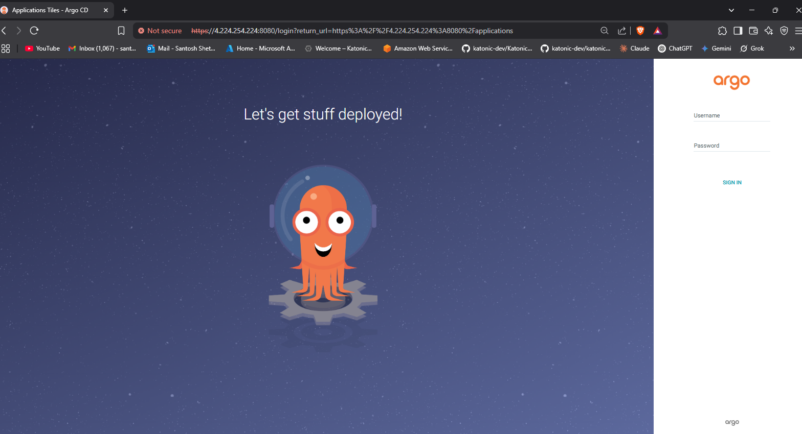
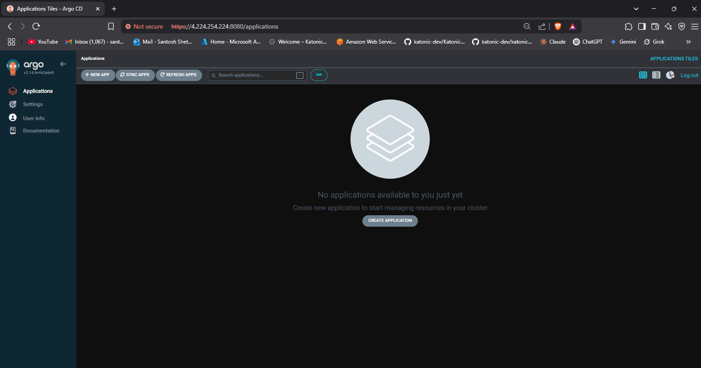
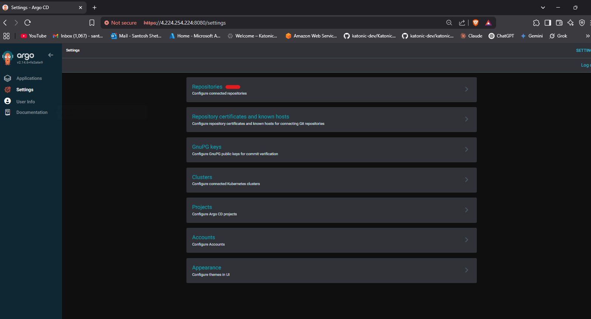
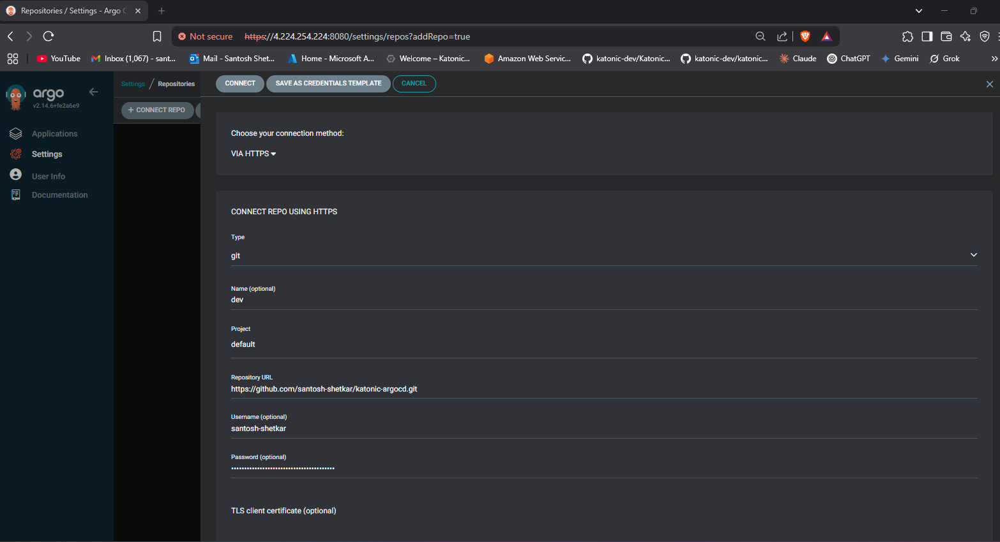
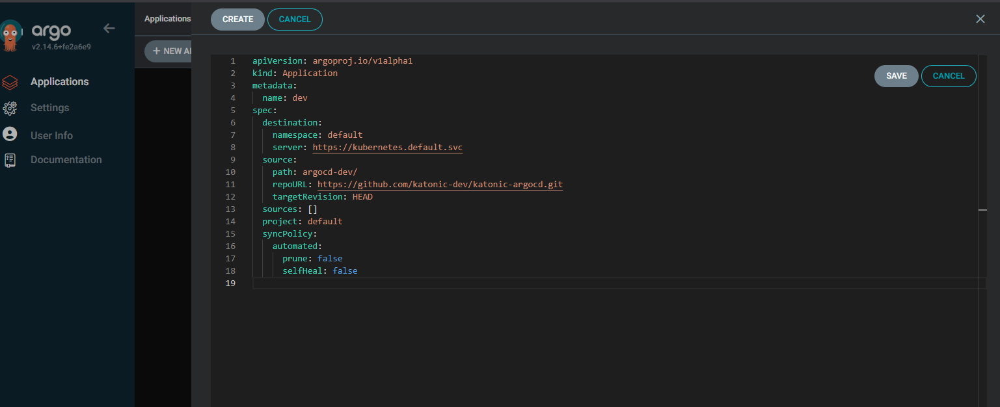
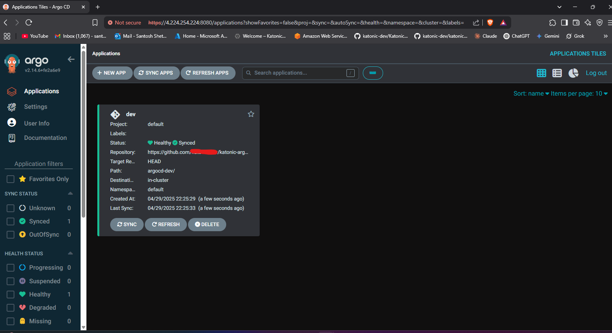

# GitOps Workflow with GitHub Actions and Argo CD

This project demonstrates a GitOps workflow utilizing GitHub Actions for the CI (Continuous Integration) pipeline and Argo CD for the CD (Continuous Deployment) pipeline.

## Overview

The workflow achieves the following:
1.  A CI pipeline, triggered by code changes, builds a new Docker image and pushes it to a container registry.
2.  The CI pipeline then updates the image tag within the Kubernetes manifests stored in a dedicated Git repository (the Argo CD repo).
3.  Argo CD detects the changes in the Git repository and automatically synchronizes the application state in the Kubernetes cluster, deploying the new image.

## Technologies Used

* **GitHub Actions:** For CI pipeline (building, testing, pushing Docker images, updating manifests).
* **Argo CD:** For CD pipeline (monitoring the Git repo, syncing manifests to the Kubernetes cluster).
* **Docker:** For containerizing the application.
* **Kubernetes:** As the container orchestration platform.
* **Nginx:** (Example application used in this workflow)[cite: 4].

## Repository Structure

This workflow typically involves two main Git repositories:

1.  **`app-repo` (Application Repository):** Contains the application source code and Dockerfile. This is where the CI pipeline (GitHub Actions) is defined.
2.  **`argocd-repo` (Configuration Repository):** Contains the Kubernetes manifests (like `deployment.yaml`, `service.yaml`, Argo CD `Application` manifest) that Argo CD monitors.

## Implementation Steps

### 1. Setting up Argo CD

* **Install Argo CD:**
    * Create a namespace: `kubectl create namespace argocd`.
    * Apply the installation manifests: `kubectl apply -n argocd -f https://raw.githubusercontent.com/argoproj/argo-cd/stable/manifests/install.yaml`.
    * Verify the installation: `kubectl get all -n argocd`.
* **Access Argo CD UI:**
    * Retrieve the initial admin password. `kubectl get secret argocd-initial-admin-secret -n argocd -o yaml` 
    * Port-forward the Argo CD server service: `kubectl port-forward svc/argocd-server -n argocd 8080:443 --address 0.0.0.0`. Access via `https://localhost:8080`.




* **Connect Git Repository:** Add your `argocd-repo` URL in the Argo CD UI under `Settings > Repositories`.




### 2. Defining the Application in Argo CD

* **Kubernetes Manifests (`argocd-repo`):** Store your application's Kubernetes manifests (e.g., `deployment.yaml`, `service.yaml`) in a specific path within this repository (e.g., `argocd-dev/`)[cite: 5, 12]. Example `deployment.yaml` and `service.yaml` for Nginx are provided in the source document[cite: 4, 5].
* **Argo CD Application Manifest (`argocd-repo`):** Create an `application.yaml` file to define how Argo CD should manage your application[cite: 9].

    ```yaml
    apiVersion: argoproj.io/v1alpha1 # Check Argo CD docs for the latest API version [cite: 10]
    kind: Application
    metadata:
      name: dev # Or your application name
      # namespace: argocd # Deploy the Application resource itself in the argocd namespace
    spec:
      project: default
      source:
        repoURL: [https://github.com/](https://github.com/)<your-org>/argocd-repo.git # Replace with your repo URL [cite: 11]
        targetRevision: HEAD # Track the latest commit [cite: 11]
        path: argocd-dev/ # Path to manifests within the repo [cite: 12]
      destination:
        server: [https://kubernetes.default.svc](https://kubernetes.default.svc) # Target cluster API server [cite: 12]
        namespace: default # Target namespace for deployment [cite: 12]
      syncPolicy:
        automated: # Enable auto-sync [cite: 12]
          prune: true # Automatically delete resources removed from Git [cite: 14]
          selfHeal: true # Automatically sync if cluster state drifts from Git [cite: 13]
          # allowEmpty: false # Prevent deployment if path is empty
        # syncOptions:
        # - CreateNamespace=true # Automatically create the namespace if it doesn't exist
    ```

* **Create Argo CD Application using this manifest inside Argo CD portal :**




### 3. Setting up the CI Pipeline (GitHub Actions)

* **Create Workflow (`app-repo`):** Define a GitHub Actions workflow file (e.g., `.github/workflows/ci-pipeline.yml`) in your application repository.

    ```yaml
    name: Build, Push, and Update Manifest

    on:
      push:
        branches:
          - main # Or your primary branch

    jobs:
      build-and-push:
        runs-on: ubuntu-latest
        outputs:
          image_tag: ${{ steps.vars.outputs.tag }}
        steps:
          - name: Checkout app code
            uses: actions/checkout@v3

          - name: Log in to Docker Hub # Or your registry
            uses: docker/login-action@v2
            with:
              username: ${{ secrets.DOCKER_USERNAME }} # Store credentials as GitHub Secrets
              password: ${{ secrets.DOCKER_PASSWORD }} 

          - name: Set image tag
            id: vars
            run: |
              TAG=nginx-${{ github.run_number }} # Example tagging strategy 
              echo "tag=$TAG" >> $GITHUB_OUTPUT 

          - name: Build and Push Docker Image
            run: |
              docker build -t ${{ secrets.IMAGE_REGISTRY }}/nginx:${{ steps.vars.outputs.tag }} . 
              docker push ${{ secrets.IMAGE_REGISTRY }}/nginx:${{ steps.vars.outputs.tag }} 
            # Ensure IMAGE_REGISTRY secret is set (e.g., your Docker Hub username or registry URL)

      update-manifest:
        needs: build-and-push # Run after building the image
        runs-on: ubuntu-latest
        steps:
          - name: Checkout argocd-repo
            uses: actions/checkout@v3
            with:
              repository: <your-org>/argocd-repo # Replace with your repo 
              token: ${{ secrets.PERSONAL_ACCESS_TOKEN }} # PAT with repo write access 
              path: argocd-repo 

          - name: Update image tag in deployment.yaml
            run: |
              cd argocd-repo/argocd-dev # Navigate to the correct path 
              IMAGE_TAG=${{ needs.build-and-push.outputs.image_tag }} # Get tag from previous job
              # Use sed, yq, or kustomize to update the image tag
              sed -i "s|image: .*|image: ${{ secrets.IMAGE_REGISTRY }}/nginx:$IMAGE_TAG|g" deployment.yaml 

          - name: Commit and Push changes
            run: |
              cd argocd-repo 
              git config user.email "ci-bot@example.com" 
              git config user.name "CI Bot" 
              git add . 
              git commit -m "Update image to ${{ needs.build-and-push.outputs.image_tag }}" [cite: 29]
              git push [cite: 29]