# 🔐 HashiCorp Vault HA on Kubernetes

This guide walks you through deploying **HashiCorp Vault** on Kubernetes using Helm, enabling High Availability with Raft storage, exposing the Vault UI, configuring Kubernetes authentication, and storing/retrieving secrets.

---

## 📦 Prerequisites

- A running Kubernetes cluster (min 3 nodes recommended for HA)
- `kubectl` installed and configured
- `helm` installed
- `jq` installed (for JSON parsing)
- Base64 and curl utilities

---

## 🚀 Install Vault using Helm

```bash
helm repo add hashicorp https://helm.releases.hashicorp.com
helm repo update

helm install vault hashicorp/vault \
  --namespace vault \
  --create-namespace \
  --set "ui.enabled=true" \
  --set "server.ha.enabled=true" \
  --set "server.ha.replicas=3" \
  --set "server.dataStorage.enabled=true" \
  --set "server.dataStorage.size=10Gi" \
  --set "server.ha.raft.enabled=true"
```

⚙️ Helm Configuration Flags Explained
--set ui.enabled=true:
Enables the Vault Web UI for easy access and management.

--set server.ha.enabled=true:
Activates High Availability (HA) mode. This allows Vault to run multiple replicas, ensuring continuity if a pod or node fails.

--set server.ha.replicas=3:
Deploys three Vault server replicas in HA mode.
⚠️ Important: For true HA, these pods should ideally be scheduled across three separate Kubernetes nodes to ensure redundancy and fault tolerance.

--set server.dataStorage.enabled=true and --set server.dataStorage.size=10Gi:
Enables persistent volume storage with a size of 10Gi per Vault pod.

--set server.ha.raft.enabled=true:
Enables Integrated Storage (Raft) as the HA storage backend.

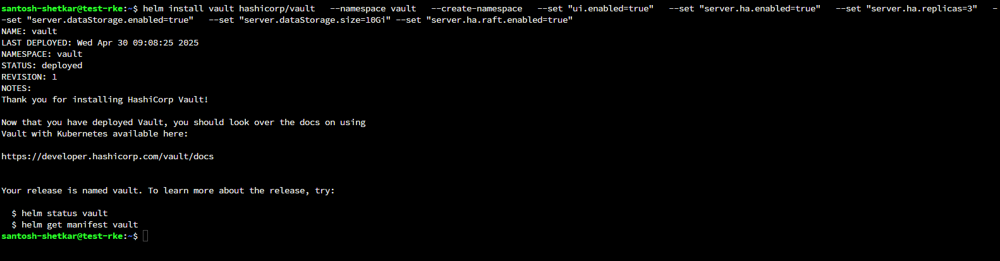
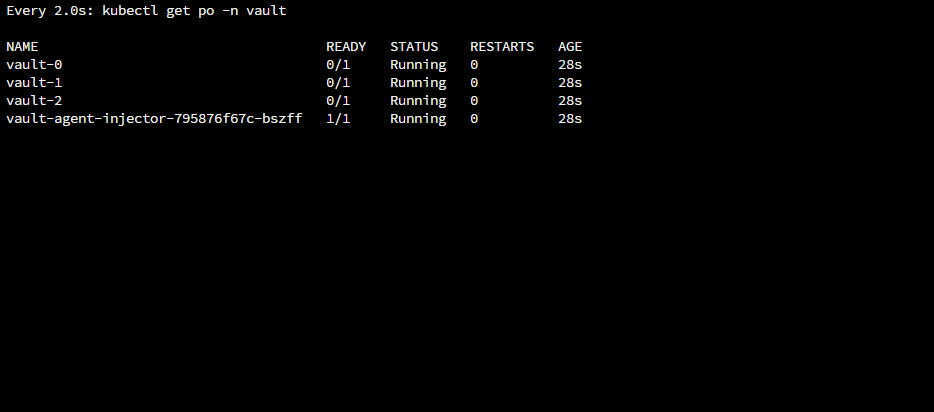

## 🌐 Expose Vault UI

```bash
kubectl patch svc vault-ui -n vault -p '{"spec": {"type": "NodePort"}}'
```

## 🧩 Initialize Vault

```bash
kubectl exec -it vault-0 -n vault -- vault operator init -key-shares=1 -key-threshold=1
```
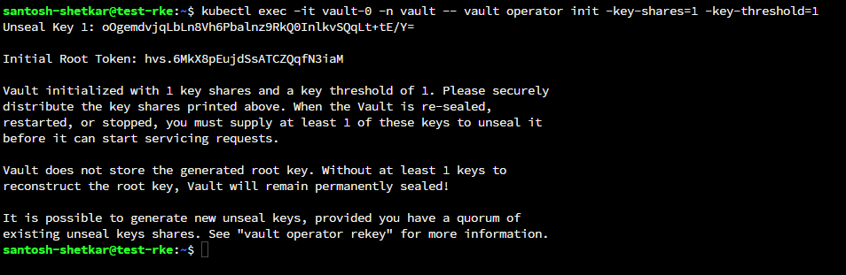

## 🔓 Unseal Vault

```bash
kubectl exec -it vault-0 -n vault -- vault operator unseal <UNSEAL_KEY>
```
Vault encrypts data and requires an "unseal" process to start and become operational.

Uses the unseal key to unlock Vault so it can start serving requests.

Without unsealing, Vault remains in a sealed state, meaning no secrets can be read or written

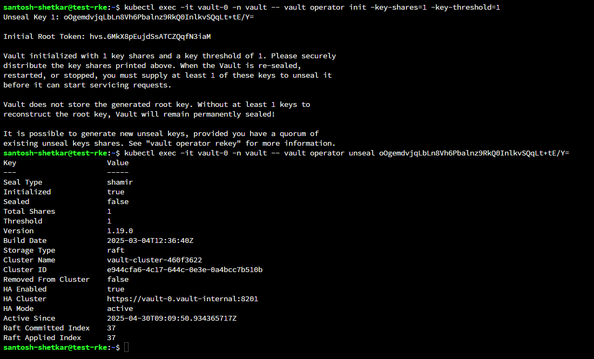

Join and unseal other pods:
```bash
kubectl exec -it vault-1 -n vault -- vault operator raft join http://vault-0.vault-internal:8200
kubectl exec -it vault-2 -n vault -- vault operator raft join http://vault-0.vault-internal:8200

kubectl exec -it vault-1 -n vault -- vault operator unseal <UNSEAL_KEY>
kubectl exec -it vault-2 -n vault -- vault operator unseal <UNSEAL_KEY>
```
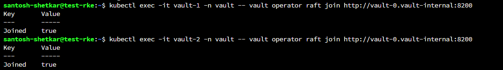

📊 Verify Vault Cluster Status

```bash
kubectl exec -it vault-0 -n vault -- vault operator raft list-peers
```
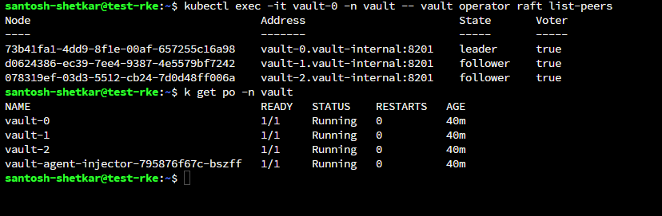

🔐 Log into Vault

```bash
kubectl exec -it vault-0 -n vault -- vault login <ROOT_TOKEN>
```
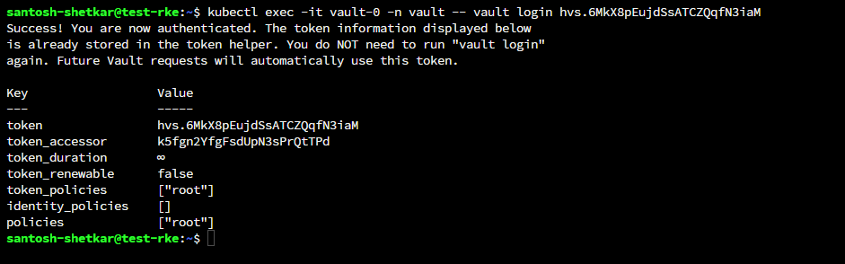

📁 Enable KV Secrets Engine (v2)
```bash
kubectl exec -it vault-0 -n vault -- vault secrets enable kv-v2
```
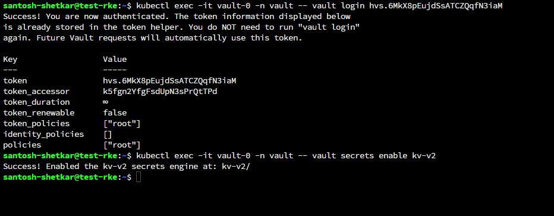

🔑 Enable Kubernetes Authentication
```bash
kubectl exec -it vault-0 -n vault -- vault auth enable kubernetes
```
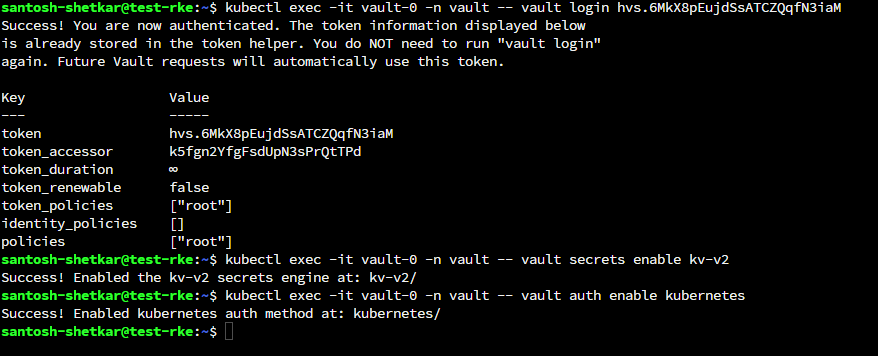

Configure Vault auth with Kubernetes:
```bash
kubectl exec -it vault-0 -n vault -- vault write auth/kubernetes/config \
  kubernetes_host="https://$KUBERNETES_SERVICE_HOST:$KUBERNETES_SERVICE_PORT"
```
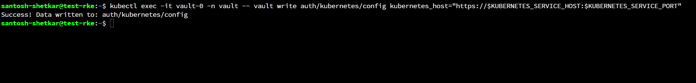

📜 Create Vault Policy
```bash
kubectl exec -it vault-0 -n vault -- vault policy write mysecret - << EOF
path "kv-v2/data/vault-demo/mysecret" {
  capabilities = ["create", "update", "read"]
}
EOF
```
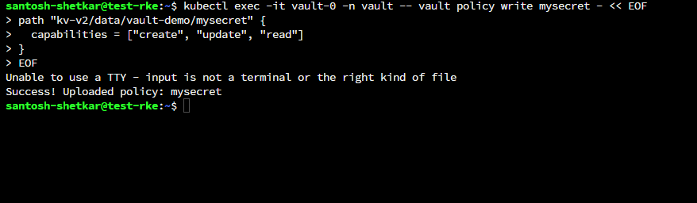

🛡️ Create Kubernetes Service Account
```bash
kubectl create sa vault-demo-sa
```
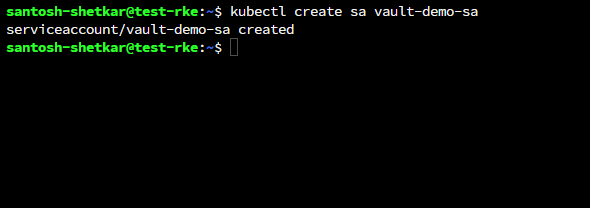
🎟️ Create Vault Role
```bash
kubectl exec -it vault-0 -n vault -- vault write auth/kubernetes/role/vault-demo \
  bound_service_account_names=vault-demo-sa \
  bound_service_account_namespaces=default \
  policies=mysecret \
  ttl=1h
```
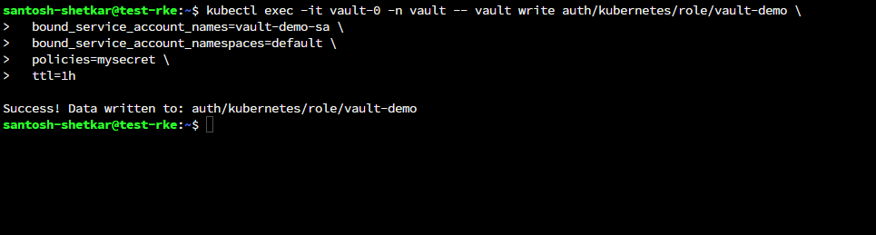

🧬 Store Secrets in Vault
Create platform-env.json:
```bash
{
  "EXTRACT_API_ENDPOINT": "http://extraction-api:8000",
  "KEYCLOAK_API_URL": "http://keycloak-svc.keycloak.svc.cluster.local:80",
  "KEYCLOAK_USER": "admin",
  "KEYCLOAK_PASSWORD": "ikxuW^uG6d:XU4S",
  "VECTORDB_USERNAME": "username",
  "VECTORDB_PASSWORD": "password",
  "VECTORDB_PORT": "19530"
}
```

Upload and store it in Vault:
```bash
kubectl cp platform-env.json vault/vault-0:/tmp/platform-env.json

kubectl exec -it vault-0 -n vault -- sh -c 'vault kv put kv-v2/vault-demo/mysecret @/tmp/platform-env.json'
```
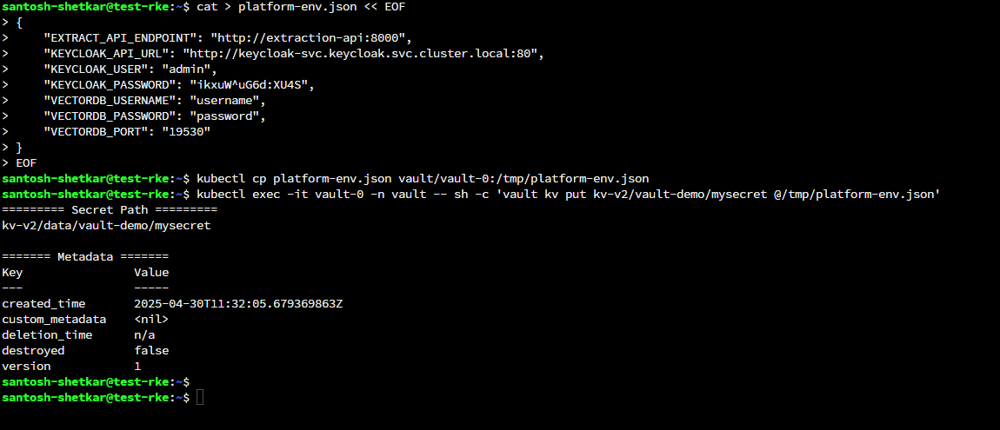

✅ Verify Secrets

```bash
kubectl exec -it vault-0 -n vault -- vault kv get kv-v2/vault-demo/mysecret
```
