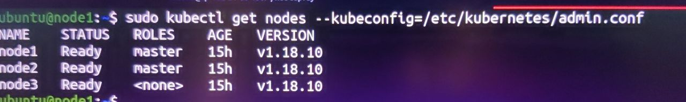

# Kubernetes Cluster Deployment using Kubespray

This guide walks through setting up an Ansible control node (on CentOS 7) and deploying a Kubernetes cluster using [Kubespray](https://github.com/kubernetes-sigs/kubespray) on Ubuntu 18.04 LTS worker nodes.

---

## 📌 Prerequisites

- **Ansible controller**: CentOS 7
- **Target nodes (cluster nodes)**: Ubuntu 18.04 LTS
- **Number of nodes**: 5
- **Default user**: `ubuntu`

---

## 🛠️ Step 1: Prepare Ansible Controller (CentOS 7)

```bash
sudo yum update -y
sudo yum install epel-release -y
sudo yum install ansible git vim python36 python3-pip -y
sudo pip3 install jinja2


## 📥 Step 2: Clone Kubespray
```bash
git clone https://github.com/kubernetes-incubator/kubespray.git
cd kubespray
pip3 install -r requirements.txt
```

## 🗂️ Step 3: Configure Inventory
```bash
cp -rfp inventory/sample inventory/mycluster
mv inventory/sample/inventory.ini inventory/mycluster/hosts
```

## ➕ Add your cluster hosts:
```
Edit inventory/mycluster/hosts:

[all]
node1 ansible_host=10.0.0.1 
node2 ansible_host=10.0.0.2 
node3 ansible_host=10.0.0.3
node4 ansible_host=10.0.0.4
node5 ansible_host=10.0.0.5

[kube-master]
node1
node2

[etcd]
node1
node2
node3

[kube-node]
node3
node4
node5

[k8s-cluster:children]
kube-node
kube-master
```

## ⚙️ Step 4: Customize Cluster Configuration
inventory/mycluster/group_vars/k8s-cluster/k8s-cluster.yml
Define Kubernetes version

Set the CNI plugin (default: calico)

inventory/mycluster/group_vars/all/all.yml
Enable metrics server by setting the read-only port:

```bash
sed -i "s/# kube_read_only_port\: 10255/kube_read_only_port\: 10255/g" inventory/mycluster/group_vars/all/all.yml
```

## 🧩 Step 5: Prepare All Nodes (Ubuntu 18.04)
Set password for ubuntu user:

```bash
sudo passwd ubuntu
Add user to sudoers without password:

echo "ubuntu ALL=(ALL) NOPASSWD: ALL" | sudo tee -a /etc/sudoers
```

Enable password authentication in SSH:

Edit /etc/ssh/sshd_config:

```bash
PasswordAuthentication yes
Restart SSH:
```
```bash
sudo systemctl restart sshd
```

## 🔐 Step 6: Set Up Passwordless SSH from Controller
```bash
ssh-keygen

ssh-copy-id ubuntu@node1
ssh-copy-id ubuntu@node2
ssh-copy-id ubuntu@node3
ssh-copy-id ubuntu@node4
ssh-copy-id ubuntu@node5
```

## 🚀 Step 7: Deploy the Kubernetes Cluster
```bash
cd kubespray
ansible-playbook -i inventory/mycluster/hosts cluster.yml -u ubuntu -b
```
## 📦 Step 8: Install kubectl on Master Node
On any of the master nodes (node1 or node2):

```bash
sudo apt update && sudo apt install -y kubectl
kubectl get nodes
```

