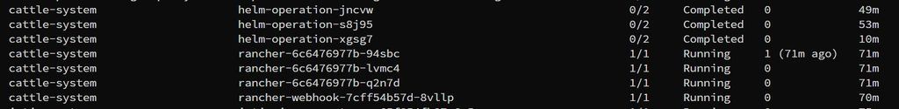
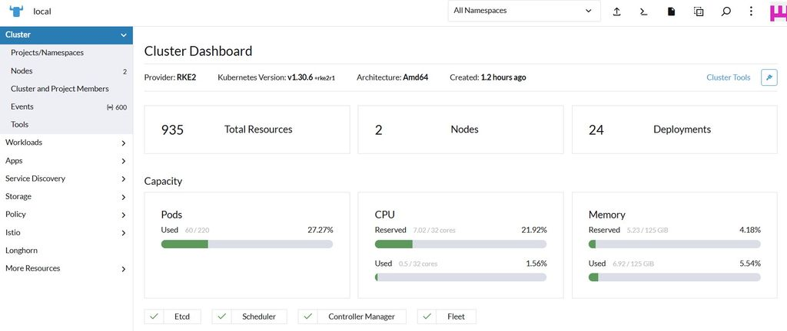
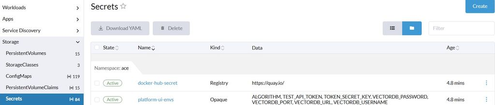
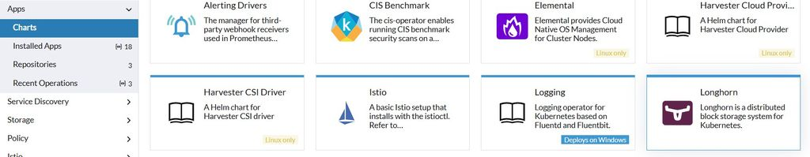
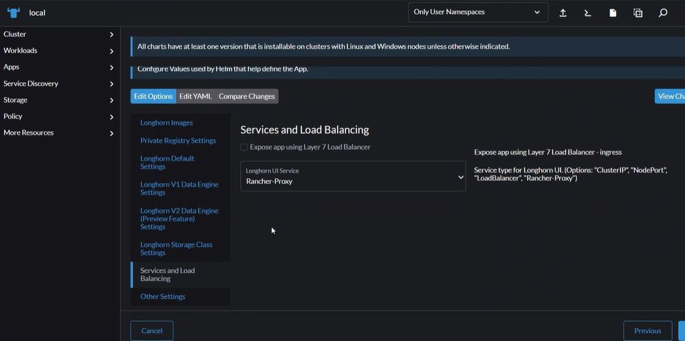
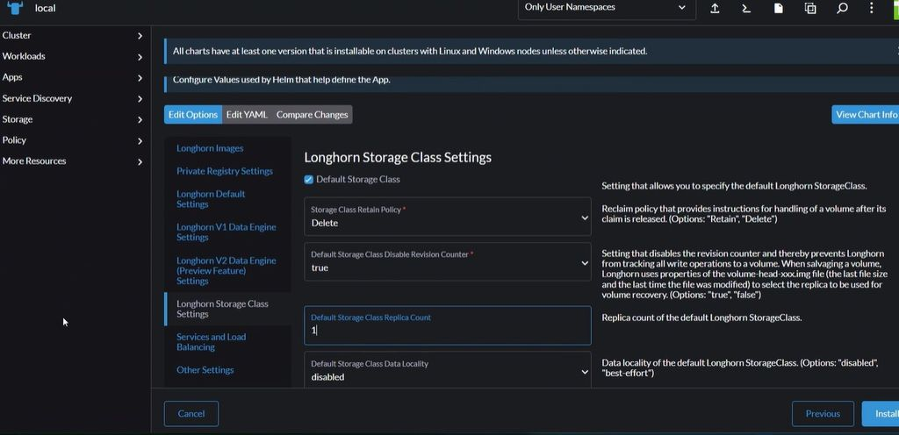

# RKE2 + Rancher + Longhorn Deployment on Reserved Servers (Rocky Linux 9)

## Instance Deployment Instructions

### Server Configuration
- **Machine Type:** any 32GB Memory and 8 core
- **Operating System:** Rocky Linux 9
- **Machine Names:** rocky-1, rocky-2, rocky-3, etc.
- **Private IPv4:** Subnet /28
- **Public IPv4:** 2nd option (static)
- **IPv6:** Off *(due to tool incompatibility)*

**SSH Access:** `root@<IPV4_address>`

> Ensure all machines are created within the same private network.

---

## Node Setup using Ansible

Create a file named `node-setup.yaml`:
```yaml
- name: Setting up RKE nodes for Installation
  hosts: rancher-hosts
  tasks:
   - name: Update all packages
     yum:
      name:
      - '*'
      state: latest

   - name: Setup iscsi,NFS
     yum:
      name:
      - iscsi-initiator-utils
      - nfs-utils
      state: present

   - name: Enable iscsi on Boot
     systemd_service:
      name: iscsid
      enabled: true
      state: started

   - name: Docker setup Prerequisite
     yum:
      name:
      - yum-utils
      state: present

   - name: Setup Docker Repo [FIX NEEDED - CANNOT RUN TWICE]
     command: yum-config-manager --add-repo https://download.docker.com/linux/centos/docker-ce.repo

   - name: Install docker
     yum:
      name:
      - docker-ce-3:27.1.2-1.el9
      - docker-ce-cli
      - containerd.io
      - docker-compose-plugin
      state: present
      allow_downgrade: true

   - name: Enable Docker on Boot
     systemd_service:
      name: docker
      enabled: true
      state: started

   - name: Reboot Nodes
     reboot:
```

Alternatively, use these manual commands:
```bash
sudo yum update -y
sudo yum install -y iscsi-initiator-utils nfs-utils\ 
sudo systemctl enable --now iscsid
sudo yum install -y yum-utils\ 
sudo yum-config-manager --add-repo https://download.docker.com/linux/centos/docker-ce.repo
sudo yum install -y docker-ce docker-ce-cli containerd.io docker-compose-plugin --allowerasing
sudo systemctl enable --now docker
# sudo reboot
```

---

## Disk Setup for Longhorn

Create `drive-setup.yaml`:
```yaml
- name: Setting up Disk Partitions for LongHorn
  hosts: rancher-drives
  tasks:
  - name: Create Disk Partition
    community.general.parted:
      device: /dev/sdb
      number: 1
      state: present
      fs_type: ext4

  - name: Create a ext4 filesystem on /dev/sdb1
    community.general.filesystem:
      fstype: ext4
      dev: /dev/sdb1

  - name: Mount disk
    ansible.posix.mount:
      path: /var/lib/longhorn
      src: /dev/sdb1
      fstype: ext4
      state: mounted
```

Alternatively:
```bash
parted /dev/sdb
mklabel gpt
mkpart primary ext4 0% 100%
quit

mkfs.ext4 /dev/sdb1
mkdir -p /var/lib/longhorn
mount /dev/sdb1 /var/lib/longhorn

# Edit /etc/fstab
vim /etc/fstab
# Add:
/dev/sdb1    /var/lib/longhorn    ext4    defaults    0    2
```

---

## Deploying RKE2 (Kubernetes Flavour)
[RKE2]( https://docs.rke2.io/install/quickstart)

### Master Node
```bash
curl -sfL https://get.rke2.io | sh -
systemctl enable rke2-server.service
systemctl start rke2-server.service
journalctl -u rke2-server -f
```

- Kubeconfig: `/etc/rancher/rke2/rke2.yaml`
- Node Token: `/var/lib/rancher/rke2/server/node-token`

> **Note:** Use **private IP** in server configuration.

### Worker Node
```bash
curl -sfL https://get.rke2.io | INSTALL_RKE2_TYPE="agent" sh -
systemctl enable rke2-agent.service

mkdir -p /etc/rancher/rke2/
vim /etc/rancher/rke2/config.yaml
# Add:
server: https://<master_private_ip>:9345
token: <paste_token_here>

systemctl start rke2-agent.service
journalctl -u rke2-agent -f
```

### Access Cluster from Master
```bash
cat /etc/rancher/rke2/rke2.yaml
# Replace 127.0.0.1 with master node's private IP
```

---

## Installing Rancher

Follow the docs: [Rancher Installation Guide](https://ranchermanager.docs.rancher.com/getting-started/installation-and-upgrade/install-upgrade-on-a-kubernetes-cluster)

### Install Helm Chart
```bash
helm repo add rancher-stable https://releases.rancher.com/server-charts/stable
kubectl create namespace cattle-system

helm install rancher rancher-stable/rancher \
  --namespace cattle-system \
  --set hostname=kaust-cluster.katonic.ai \
  --set bootstrapPassword=admin \
  --set ingress.tls.source=secret
```

- Map the DNS of hostname to master IP.   
- Access Rancher UI using DNS + password.



### Create TLS Secret in Rancher UI (Optional)
- **Secret Name:** `tls-rancher-ingress`
- **Include:** certs and key of domain


---

## Deploy Longhorn

- Navigate to **Apps** → **Longhorn** in Rancher UI
- Set **Replicas = 1**
- Enable **V1 Data Integrity**
- Access Longhorn UI via Rancher Proxy




### Longhorn Settings
- **Reservations:** 0
- **Taints and Tolerations:** Set appropriately

### Storage Class
- Create `kfs` StorageClass
- Set it as **default**

---

## DNS Mapping in Equinix

### Istio Gateway Service to NodePort
```bash
kubectl edit svc istio-ingressgateway -n istio-system
# Change type: ClusterIP → NodePort
```

### Example Output
```
istio-ingressgateway   NodePort   10.43.166.223   <none>   15021:32711/TCP,80:31421/TCP,443:30462/TCP   17m
```

### Setup Metal LB

## 🔧 MetalLB Setup for Bare-Metal Kubernetes Cluster

MetalLB allows you to expose services using a LoadBalancer type in environments that don’t support cloud load balancers (like on-prem or bare-metal clusters).

### 📌 Prerequisites

- Kubernetes cluster up and running.
- Access to `kubectl` with cluster-admin permissions.
- A range of IP addresses from your local network that MetalLB can assign (not already used by other machines).

---

### ✅ Step 1: Install MetalLB

```bash
kubectl apply -f https://raw.githubusercontent.com/metallb/metallb/v0.13.10/config/manifests/metallb-native.yaml
```

> 📌 [MetalLB Official Manifests](https://github.com/metallb/metallb)

---

### ✅ Step 2: Create a MetalLB IP Address Pool

Edit and apply the following manifest:

```yaml
# metallb-config.yaml
apiVersion: metallb.io/v1beta1
kind: IPAddressPool
metadata:
  namespace: metallb-system
  name: default-address-pool
spec:
  addresses:
  - 192.168.1.240-192.168.1.250  # Replace with an IP range from your LAN
---
apiVersion: metallb.io/v1beta1
kind: L2Advertisement
metadata:
  namespace: metallb-system
  name: l2-advertisement
spec:
  ipAddressPools:
  - default-address-pool
```

Apply the config:

```bash
kubectl apply -f metallb-config.yaml
```

---

### ✅ Step 3: Verify MetalLB is Running

```bash
kubectl get pods -n metallb-system
```

You should see the controller and speaker pods running.

---

### ✅ Step 4: Test MetalLB with a LoadBalancer Service

```yaml
apiVersion: v1
kind: Service
metadata:
  name: nginx-lb
  namespace: default
spec:
  selector:
    app: nginx
  type: LoadBalancer
  ports:
  - protocol: TCP
    port: 80
    targetPort: 80
```

Create a sample nginx deployment if needed:

```bash
kubectl create deployment nginx --image=nginx
```

Then apply the service manifest:

```bash
kubectl apply -f nginx-lb.yaml
```

Check the assigned external IP:

```bash
kubectl get svc nginx-lb
```

You should see an external IP from the pool you defined.

---

### 🔐 Notes:

- Use **Layer2 mode** (default) for simple setups.
- Avoid IP conflicts – make sure the address pool is outside DHCP ranges or manually reserved.
- MetalLB supports BGP mode if advanced routing is needed.


